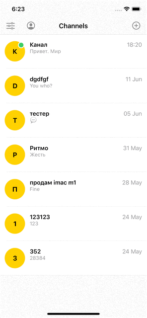

# Messenger

The task was to create a simple channel-based messenger app with the minimum amount of dependencies

## Features and technologies
- iOS 12+
- Dynamic message and channel synchronizing
- <b>Custom themes</b>, even on iOS 12
- Messages and channels are being saved to <b>Core Data</b>
- Custom onboarding
- <b>SOLID</b> and <b>SOA</b> driven development
- Custom <b>animations</b>
- <b>Unit tests</b> and <b>UI tests</b> using <b>XCTest</b>
- <b>CI</b>

## Usage

